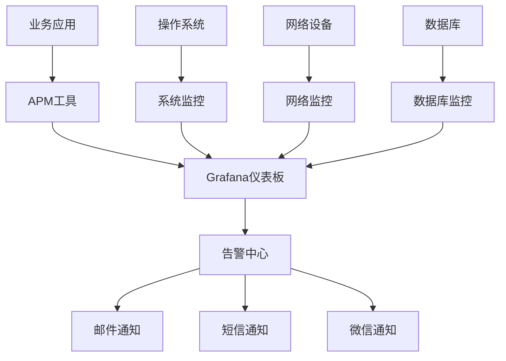
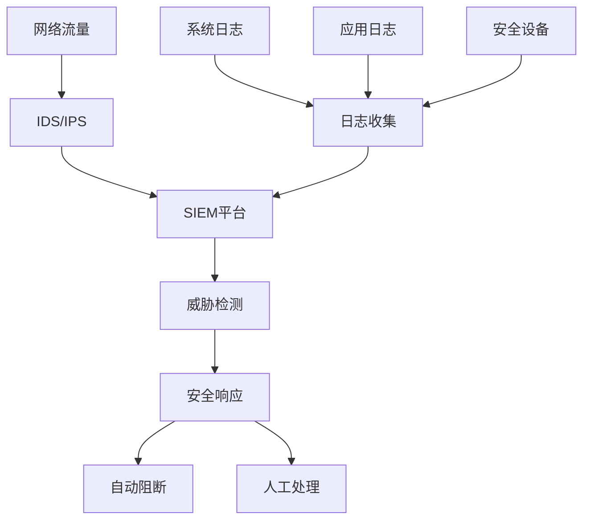

# 管理工具推荐 - 中小企业IT基础设施 (50-100人)

## 工具推荐概述
本文档为50-100人规模的中小企业提供全面的IT管理工具推荐，重点关注成本效益、易用性、可扩展性和实用性，帮助企业建立高效的IT管理体系。

## 1. 基础设施监控工具

### 1.1 系统监控

#### 开源解决方案

**Zabbix**
```yaml
推荐指数: ⭐⭐⭐⭐⭐
适用场景: 全面系统监控
成本: 免费开源
优势:
  - 功能强大，支持多种监控方式
  - 可监控网络、服务器、应用、数据库
  - 强大的告警和通知功能
  - 丰富的可视化界面
  - 活跃的社区支持
劣势:
  - 学习曲线较陡峭
  - 需要一定的配置时间
  - 界面相对传统

部署复杂度: 中等
维护难度: 中等
推荐配置:
  - 2核4GB内存用于50台设备监控
  - 4核8GB内存用于100+台设备监控
```

**Prometheus + Grafana**
```yaml
推荐指数: ⭐⭐⭐⭐⭐
适用场景: 现代化监控解决方案
成本: 免费开源
优势:
  - 时间序列数据库，查询性能优秀
  - Grafana提供美观的可视化界面
  - 云原生监控标准
  - 强大的标签系统
  - 丰富的第三方集成
劣势:
  - 需要多个组件配合
  - 配置相对复杂
  - 需要一定技术基础

部署复杂度: 中高
维护难度: 中等
推荐配置:
  - Prometheus: 2核4GB内存
  - Grafana: 1核2GB内存
```

#### 商业解决方案

**SolarWinds NPM**
```yaml
推荐指数: ⭐⭐⭐⭐
适用场景: 企业级网络监控
成本: $2,995起/年 (100元素)
优势:
  - 专业的网络监控工具
  - 直观的网络拓扑图
  - 强大的性能分析
  - 完善的技术支持
劣势:
  - 价格较高
  - 主要专注网络监控
  - 需要Windows服务器

推荐场景: 网络复杂度高的企业
```

**PRTG Network Monitor**
```yaml
推荐指数: ⭐⭐⭐⭐
适用场景: 一体化监控解决方案
成本: 100传感器免费，$1,600/年 (500传感器)
优势:
  - 易于部署和配置
  - 一体化监控平台
  - 美观的Web界面
  - 移动应用支持
劣势:
  - 基于传感器数量计费
  - Windows平台为主
  - 高级功能需要付费

推荐场景: 需要快速部署的中小企业
```

### 1.2 应用性能监控(APM)

#### 开源解决方案

**Elastic APM**
```yaml
推荐指数: ⭐⭐⭐⭐
适用场景: 应用性能深度监控
成本: 免费开源（基础功能）
优势:
  - 集成Elastic Stack生态
  - 分布式追踪功能
  - 多语言支持
  - 强大的日志关联
劣势:
  - 需要ELK技术栈
  - 高级功能需要付费版
  - 资源消耗较大

部署复杂度: 高
维护难度: 中高
```

**Jaeger**
```yaml
推荐指数: ⭐⭐⭐
适用场景: 微服务追踪
成本: 免费开源
优势:
  - 专业的分布式追踪
  - CNCF项目，社区活跃
  - 支持多种存储后端
劣势:
  - 专注追踪功能
  - 需要代码级集成
  - 不包含传统APM功能

推荐场景: 微服务架构企业
```

#### 商业解决方案

**New Relic**
```yaml
推荐指数: ⭐⭐⭐⭐⭐
适用场景: 全栈应用监控
成本: $25/月/用户起
优势:
  - 功能全面的APM平台
  - 智能告警和分析
  - 用户体验监控
  - 优秀的用户界面
劣势:
  - 价格较高
  - 按用户数计费
  - 部分功能需要高级版

推荐场景: 应用性能要求高的企业
```

## 2. 网络管理工具

### 2.1 网络监控和管理

**LibreNMS**
```yaml
推荐指数: ⭐⭐⭐⭐⭐
适用场景: 网络设备监控
成本: 免费开源
优势:
  - 专业的网络监控
  - 支持众多网络设备
  - 自动发现网络设备
  - 活跃的开发社区
  - 基于PHP/MySQL，易于部署
劣势:
  - 主要专注网络监控
  - Web界面相对简单
  - 需要SNMP支持

部署复杂度: 中等
维护难度: 低
推荐配置: 2核4GB内存，监控100+网络设备
```

**Nagios Core**
```yaml
推荐指数: ⭐⭐⭐⭐
适用场景: 基础设施监控
成本: 免费开源
优势:
  - 成熟稳定的监控系统
  - 强大的插件生态
  - 灵活的配置选项
  - 社区支持良好
劣势:
  - 配置文件复杂
  - Web界面较老旧
  - 需要大量手工配置

部署复杂度: 高
维护难度: 中高
推荐场景: 有经验的运维团队
```

### 2.2 网络安全工具

**pfSense**
```yaml
推荐指数: ⭐⭐⭐⭐⭐
适用场景: 企业防火墙和路由
成本: 免费开源
优势:
  - 企业级防火墙功能
  - VPN服务器内置
  - 流量整形和QoS
  - Web界面管理
  - 丰富的插件包
劣势:
  - 需要专用硬件
  - 高级功能学习曲线陡峭
  - 故障排除需要网络知识

部署复杂度: 中等
维护难度: 中等
推荐硬件: 4核8GB内存，双网卡
```

**Suricata**
```yaml
推荐指数: ⭐⭐⭐⭐
适用场景: 入侵检测系统(IDS/IPS)
成本: 免费开源
优势:
  - 高性能网络安全监控
  - 支持多线程处理
  - 丰富的规则集
  - JSON格式日志输出
劣势:
  - 需要专业安全知识
  - 规则维护工作量大
  - 误报需要调优

部署复杂度: 高
维护难度: 高
推荐场景: 有安全专业人员的企业
```

## 3. 系统管理工具

### 3.1 配置管理

**Ansible**
```yaml
推荐指数: ⭐⭐⭐⭐⭐
适用场景: 自动化配置管理
成本: 免费开源
优势:
  - 无需客户端代理
  - YAML语法简单易懂
  - 强大的模块库
  - 红帽公司支持
  - 学习曲线相对平缓
劣势:
  - 大规模部署性能有限
  - 调试相对困难
  - 复杂逻辑实现困难

部署复杂度: 低
维护难度: 低
推荐场景: 中小企业标准化管理
```

**Puppet**
```yaml
推荐指数: ⭐⭐⭐⭐
适用场景: 企业级配置管理
成本: 开源版免费，企业版$120/节点/年
优势:
  - 成熟的配置管理平台
  - 强大的依赖管理
  - 丰富的模块库
  - 企业级功能完善
劣势:
  - 学习曲线陡峭
  - Ruby DSL语法复杂
  - 需要专用的Puppet Server

部署复杂度: 高
维护难度: 中高
推荐场景: 大规模标准化环境
```

### 3.2 远程管理

**TeamViewer Business**
```yaml
推荐指数: ⭐⭐⭐⭐⭐
适用场景: 远程桌面支持
成本: $50.90/月起
优势:
  - 易于使用的远程桌面
  - 跨平台支持
  - 文件传输功能
  - 移动设备支持
  - 会话录制功能
劣势:
  - 订阅制付费模式
  - 依赖互联网连接
  - 免费版有使用限制

推荐场景: 需要频繁远程支持的企业
```

**RustDesk**
```yaml
推荐指数: ⭐⭐⭐⭐
适用场景: 开源远程桌面
成本: 免费开源
优势:
  - 完全免费开源
  - 可自建服务器
  - 跨平台支持
  - 类似TeamViewer体验
劣势:
  - 功能相对简单
  - 社区支持有限
  - 企业级功能不足

推荐场景: 成本敏感的中小企业
```

## 4. 数据库管理工具

### 4.1 数据库监控

**Percona Monitoring and Management (PMM)**
```yaml
推荐指数: ⭐⭐⭐⭐⭐
适用场景: MySQL/PostgreSQL监控
成本: 免费开源
优势:
  - 专业的数据库监控
  - 查询分析功能强大
  - Grafana集成界面
  - 性能建议功能
劣势:
  - 主要支持MySQL/PostgreSQL
  - 部署相对复杂
  - 需要一定数据库知识

部署复杂度: 中等
维护难度: 中等
推荐配置: 4核8GB内存
```

**phpMyAdmin**
```yaml
推荐指数: ⭐⭐⭐⭐
适用场景: MySQL Web管理
成本: 免费开源
优势:
  - 简单易用的Web界面
  - 功能全面的MySQL管理
  - 部署简单
  - 广泛使用，社区活跃
劣势:
  - 只支持MySQL
  - 安全性需要额外配置
  - 不适合生产环境直接访问

推荐场景: MySQL开发和测试环境
```

### 4.2 数据库备份

**Bacula**
```yaml
推荐指数: ⭐⭐⭐⭐
适用场景: 企业级备份解决方案
成本: 免费开源
优势:
  - 专业的备份软件
  - 支持多种存储介质
  - 灵活的备份策略
  - 可扩展架构
劣势:
  - 配置复杂
  - 学习曲线陡峭
  - Web界面需要额外安装

部署复杂度: 高
维护难度: 高
推荐场景: 大量数据备份需求
```

**Duplicati**
```yaml
推荐指数: ⭐⭐⭐⭐
适用场景: 增量备份解决方案
成本: 免费开源
优势:
  - 支持多种云存储
  - 增量和重复数据删除
  - 加密备份功能
  - Web界面管理
劣势:
  - 相对较新的项目
  - 企业级功能有限
  - 大文件备份性能一般

推荐场景: 中小企业数据备份
```

## 5. 安全管理工具

### 5.1 漏洞扫描

**OpenVAS**
```yaml
推荐指数: ⭐⭐⭐⭐⭐
适用场景: 漏洞扫描和评估
成本: 免费开源
优势:
  - 功能强大的漏洞扫描器
  - 定期更新漏洞库
  - 详细的扫描报告
  - 支持网络和Web应用扫描
劣势:
  - 部署和配置复杂
  - 资源消耗较大
  - 扫描时间较长

部署复杂度: 高
维护难度: 中等
推荐配置: 4核8GB内存，200GB存储
```

**Nessus Essentials**
```yaml
推荐指数: ⭐⭐⭐⭐
适用场景: 小规模漏洞扫描
成本: 免费（16个IP）
优势:
  - 专业的漏洞扫描器
  - 易于部署和使用
  - 详细的漏洞信息
  - 优秀的用户界面
劣势:
  - 免费版IP数量限制
  - 商业版价格较高
  - 需要定期更新许可

推荐场景: 小规模网络安全扫描
```

### 5.2 日志分析

**ELK Stack (Elasticsearch + Logstash + Kibana)**
```yaml
推荐指数: ⭐⭐⭐⭐⭐
适用场景: 集中日志管理和分析
成本: 免费开源（基础功能）
优势:
  - 强大的日志搜索和分析
  - 实时数据处理
  - 丰富的可视化功能
  - 大规模数据处理能力
劣势:
  - 资源消耗大
  - 配置和维护复杂
  - 高级功能需要付费

部署复杂度: 高
维护难度: 高
推荐配置: 
  - Elasticsearch: 8核16GB内存
  - Logstash: 4核8GB内存
  - Kibana: 2核4GB内存
```

**Graylog**
```yaml
推荐指数: ⭐⭐⭐⭐
适用场景: 日志管理平台
成本: 开源版免费，企业版$2/GB/月
优势:
  - 专注日志管理
  - 相对简单的部署
  - 强大的搜索功能
  - 告警和通知功能
劣势:
  - 社区版功能有限
  - 可视化功能不如Kibana
  - 企业版价格较高

推荐场景: 专注日志分析的企业
```

## 6. 协作和项目管理工具

### 6.1 项目管理

**Jira**
```yaml
推荐指数: ⭐⭐⭐⭐⭐
适用场景: 敏捷项目管理
成本: $7/用户/月起
优势:
  - 功能强大的项目管理
  - 敏捷开发支持
  - 丰富的集成选项
  - 可定制的工作流
劣势:
  - 价格较高
  - 配置复杂
  - 对非技术用户不够友好

推荐场景: 软件开发团队
```

**禅道项目管理软件**
```yaml
推荐指数: ⭐⭐⭐⭐
适用场景: 中文项目管理
成本: 开源版免费，专业版168元/人/年
优势:
  - 中文界面和文档
  - 集成项目、产品、测试管理
  - 本土化功能完善
  - 部署简单
劣势:
  - 界面相对传统
  - 国际化支持有限
  - 移动端体验一般

推荐场景: 中文环境项目管理
```

### 6.2 文档管理

**DokuWiki**
```yaml
推荐指数: ⭐⭐⭐⭐⭐
适用场景: 企业知识库
成本: 免费开源
优势:
  - 无需数据库，基于文件
  - 安装和维护简单
  - 强大的权限管理
  - 插件生态丰富
劣势:
  - 界面相对简单
  - 大量内容时性能有限
  - 不支持所见即所得编辑

部署复杂度: 低
维护难度: 低
推荐场景: IT文档和知识管理
```

**BookStack**
```yaml
推荐指数: ⭐⭐⭐⭐
适用场景: 现代化文档平台
成本: 免费开源
优势:
  - 现代化的界面设计
  - 层次化的内容组织
  - 所见即所得编辑
  - 良好的搜索功能
劣势:
  - 需要数据库支持
  - 相对较新的项目
  - 插件生态有限

推荐场景: 注重用户体验的文档管理
```

## 7. 备份和恢复工具

### 7.1 文件备份

**Veeam Backup & Replication Community Edition**
```yaml
推荐指数: ⭐⭐⭐⭐⭐
适用场景: 虚拟机备份
成本: 免费（10个VM）
优势:
  - 专业的虚拟机备份
  - 快速恢复功能
  - 重复数据删除
  - 集中管理界面
劣势:
  - 免费版有数量限制
  - 主要支持VMware/Hyper-V
  - 物理机备份需要付费版

推荐场景: 虚拟化环境备份
```

**Restic**
```yaml
推荐指数: ⭐⭐⭐⭐
适用场景: 加密备份解决方案
成本: 免费开源
优势:
  - 客户端加密
  - 重复数据删除
  - 支持多种存储后端
  - 跨平台支持
劣势:
  - 命令行工具
  - 缺少图形界面
  - 需要手动配置

推荐场景: 安全要求高的数据备份
```

### 7.2 系统镜像

**Clonezilla**
```yaml
推荐指数: ⭐⭐⭐⭐⭐
适用场景: 系统克隆和镜像
成本: 免费开源
优势:
  - 强大的磁盘克隆功能
  - 支持多种文件系统
  - 批量部署功能
  - Live CD/USB启动
劣势:
  - 界面相对简单
  - 需要一定技术知识
  - 增量备份功能有限

推荐场景: 系统部署和灾难恢复
```

## 8. 成本管理工具

### 8.1 资产管理

**Snipe-IT**
```yaml
推荐指数: ⭐⭐⭐⭐⭐
适用场景: IT资产管理
成本: 免费开源
优势:
  - 完整的资产生命周期管理
  - 条码/二维码支持
  - 报告和审计功能
  - 移动应用支持
劣势:
  - 需要PHP/MySQL环境
  - 中文本地化不完整
  - 需要手动录入数据

部署复杂度: 中等
维护难度: 低
推荐场景: IT资产较多的企业
```

**OCS Inventory NG**
```yaml
推荐指数: ⭐⭐⭐⭐
适用场景: 自动资产发现
成本: 免费开源
优势:
  - 自动设备发现和清单
  - 软件许可管理
  - 网络资产扫描
  - Web界面管理
劣势:
  - 部署相对复杂
  - 界面较为传统
  - 需要在设备上安装代理

推荐场景: 需要自动资产发现的企业
```

## 9. 工具选择建议

### 9.1 按企业规模选择

#### 50人以下企业推荐配置
```yaml
核心工具组合:
  监控: PRTG Network Monitor (免费版) + Zabbix
  安全: pfSense + OpenVAS
  备份: Veeam Community Edition + Duplicati
  文档: DokuWiki
  项目管理: 禅道开源版
  远程支持: RustDesk

总成本: 接近免费
部署复杂度: 中等
维护工作量: 中等
```

#### 50-100人企业推荐配置
```yaml
核心工具组合:
  监控: Prometheus + Grafana
  APM: Elastic APM
  安全: pfSense + Suricata + ELK Stack
  配置管理: Ansible
  备份: Veeam + Restic
  文档: BookStack
  项目管理: 禅道专业版
  远程支持: TeamViewer Business

总成本: 约3-5万元/年
部署复杂度: 中高
维护工作量: 中等
```

### 9.2 按预算选择

#### 低预算方案 (1万元/年以下)
```yaml
工具选择原则:
  - 优先选择开源免费工具
  - 关注社区支持和文档
  - 可接受较高的学习成本
  - 内部培养技术能力

推荐工具:
  - Zabbix + LibreNMS
  - ELK Stack
  - Ansible
  - DokuWiki
  - 禅道开源版
```

#### 中等预算方案 (3-8万元/年)
```yaml
工具选择原则:
  - 开源工具为主，关键点商业工具
  - 平衡功能和成本
  - 注重用户体验
  - 选择性投入培训

推荐工具:
  - Prometheus + Grafana
  - PRTG Network Monitor
  - TeamViewer Business
  - 禅道专业版
  - Veeam备份
```

#### 充足预算方案 (8万元/年以上)
```yaml
工具选择原则:
  - 优选商业成熟产品
  - 注重技术支持和服务
  - 追求最佳用户体验
  - 投入专业培训

推荐工具:
  - SolarWinds套件
  - New Relic
  - Jira + Confluence
  - 企业级备份解决方案
```

## 10. 工具集成架构

### 10.1 监控集成架构


### 10.2 安全集成架构


## 11. 实施路线图

### 11.1 第一阶段 (1-2个月)
```yaml
目标: 建立基础监控和管理能力
优先级: 高
实施内容:
  - 部署系统监控工具 (Zabbix/Prometheus)
  - 配置基础网络监控
  - 建立备份策略
  - 部署远程管理工具
完成标准:
  - 所有关键设备纳入监控
  - 基础告警机制建立
  - 数据备份验证通过
```

### 11.2 第二阶段 (2-3个月)
```yaml
目标: 完善安全和自动化管理
优先级: 中高
实施内容:
  - 部署安全监控工具
  - 实施配置管理自动化
  - 建立知识库和文档系统
  - 优化监控告警策略
完成标准:
  - 安全事件监控覆盖完整
  - 标准化配置管理建立
  - 操作文档完善
```

### 11.3 第三阶段 (3-6个月)
```yaml
目标: 提升管理效率和用户体验
优先级: 中等
实施内容:
  - 部署APM和深度监控
  - 实施成本管理工具
  - 优化工具集成和自动化
  - 团队培训和认证
完成标准:
  - 应用性能监控建立
  - 成本控制机制有效
  - 团队技能提升显著
```

## 12. 工具评估框架

### 12.1 评估维度
```yaml
功能性评估 (30%):
  - 功能完整性
  - 性能表现
  - 可扩展性
  - 集成能力

易用性评估 (25%):
  - 学习曲线
  - 用户界面
  - 文档质量
  - 社区支持

成本效益评估 (25%):
  - 采购成本
  - 维护成本
  - 培训成本
  - ROI分析

技术评估 (20%):
  - 技术架构
  - 安全性
  - 稳定性
  - 更新频率
```

### 12.2 选择决策矩阵
```yaml
评分标准 (1-5分):
  1分: 不满足要求
  2分: 基本满足要求
  3分: 满足要求
  4分: 超出预期
  5分: 行业领先

加权计算:
  最终得分 = Σ(维度得分 × 权重)

决策标准:
  4.0分以上: 强力推荐
  3.5-4.0分: 推荐
  3.0-3.5分: 可考虑
  3.0分以下: 不推荐
```

## 13. 工具部署清单

### 13.1 硬件资源规划
```yaml
监控服务器:
  CPU: 8核以上
  内存: 16GB以上
  存储: 500GB SSD + 2TB HDD
  网络: 双千兆网卡
  数量: 1-2台

日志服务器:
  CPU: 8核以上
  内存: 32GB以上
  存储: 1TB SSD + 4TB HDD
  网络: 双千兆网卡
  数量: 1台

备份服务器:
  CPU: 4核以上
  内存: 8GB以上
  存储: 10TB以上
  网络: 双千兆网卡
  数量: 1台
```

### 13.2 网络要求
```yaml
带宽要求:
  - 内网: 千兆以上
  - 外网: 100M以上
  - 管理网络: 独立VLAN

端口开放:
  - HTTP: 80, 8080, 3000
  - HTTPS: 443, 8443
  - SSH: 22
  - SNMP: 161/162
  - 数据库: 3306, 5432
  - 监控: 10050, 9090, 9200
```

### 13.3 人员技能要求
```yaml
基础技能:
  - Linux系统管理
  - 网络基础知识
  - 数据库基本操作
  - Shell脚本编写

进阶技能:
  - 容器技术 (Docker)
  - 配置管理 (Ansible)
  - 监控系统配置
  - 日志分析

专业技能:
  - 安全技术
  - 性能调优
  - 故障排除
  - 架构设计
```

## 14. 成功案例参考

### 14.1 制造业企业案例
```yaml
企业背景:
  - 规模: 80人
  - 行业: 制造业
  - IT基础: 中等

采用方案:
  - 监控: Zabbix + LibreNMS
  - 安全: pfSense + OpenVAS
  - 备份: Veeam Community + 本地NAS
  - 管理: Ansible + DokuWiki

实施效果:
  - 系统可用性: 99.2% → 99.8%
  - 故障响应时间: 2小时 → 15分钟
  - IT成本节省: 20%
  - 运维效率提升: 40%
```

### 14.2 科技公司案例
```yaml
企业背景:
  - 规模: 120人
  - 行业: 软件开发
  - IT基础: 较好

采用方案:
  - 监控: Prometheus + Grafana
  - APM: Elastic APM
  - 安全: ELK Stack + Suricata  
  - 管理: GitLab + Jira

实施效果:
  - 应用性能提升: 30%
  - 安全事件检测率: 95%
  - 开发效率提升: 25%
  - 系统稳定性显著改善
```

## 15. 总结和建议

### 15.1 选择原则
1. **量力而行**: 根据企业规模和技术能力选择合适的工具
2. **循序渐进**: 分阶段实施，避免一次性投入过大
3. **开源优先**: 在满足需求的前提下优选开源方案
4. **注重集成**: 选择能够良好集成的工具组合
5. **持续优化**: 根据使用情况不断调整和优化

### 15.2 避免的误区
1. **工具堆砌**: 避免为了追求全面而引入过多工具
2. **忽视培训**: 工具再好也需要人员能够熟练使用
3. **过度依赖**: 保持对关键工具的可替代性
4. **忽视成本**: 综合考虑采购、实施、维护等全生命周期成本

### 15.3 未来发展趋势
1. **云原生工具**: 更多工具将提供云原生版本
2. **AI集成**: 人工智能将在监控和运维中发挥更大作用
3. **自动化程度提升**: 更多场景将实现完全自动化
4. **安全集成**: 安全功能将更深度集成到各类工具中

---
*文档版本：v1.0*  
*创建日期：2025年8月*  
*适用规模：50-100人中小企业*  
*负责人：IT工具评估团队*